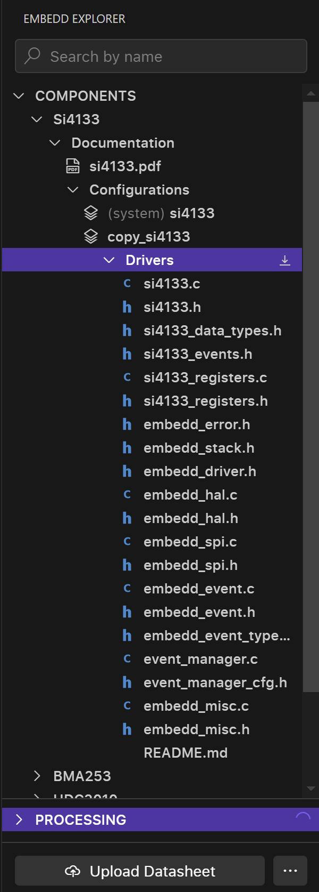
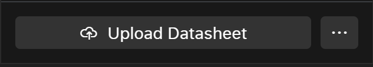
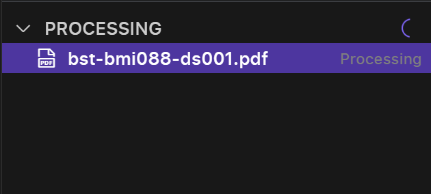

# Embedd Explorer Structure

💡 All of your components are stored in the Embedd Explorer, i.e. component tree.

Embedd Explorer has the following structure:

1. Component Name  reflects part number of the component
2. Documentation  folder that will contain all of the documentation related to the component. Each component might have multiple documentation sources, i.e. reflecting datasheet revisions.
3. Configuration  each Documentation version will have a nested Configuration folder. Configurations are editable representations of Digital Component Model. The folder will contain all of the configurations user generates for that documentation set. A default, “system” configuration will always be available and hold unedited configuration.
4. Drivers  folder with driver source code library will be nested under each configuration, if user generated code for it.

Embedd Explorer Overview

# Adding a New Component

In order to add a new component you must press the Upload Datasheet button in the header of the Component section and select a datasheet to upload. The datasheet needs to be uploaded from a local environment.

Adding component to the system

Processing a datasheet can take anywhere from 5 minutes to an hour. Therefore, components labeled as "processing" will appear in the related tab during this time.

Datasheet Processing State

Onсe the component has been processed user can access digital component model by clicking on the configuration of this component.

# Component Search

User can use search to search for a specific component or configuration. Search functionality cover a partly matching and full match.

# General Device Info

General device information section covers basic device and interface information.

Overview of General Information Tab

General device info:

 Device name
 Device vendor
 Device class

Interface info:

 - Type
    - Type is selectable (I2C, SPI, UART). Once you have selected the specific bus type e.g. related bus options will be available for selection and this type will be used for a driver generation.
 - Role
 - Bus options
    - I2C
        - Frequency
        - Address value
        - Address size
    - SPI
        - Supported modes
        - MSB first
        - Ship select active low
        - Full Duplex
        - Max frequency
        - Data size

# Registers

The registers section is a register map of the device where user can manually add new register and change the extracted register list.

The number at the top of the chapter heading indicates the amount of extracted and manually created registers of this component.

Default view of the register map is a list of:
- Name
- Address
- Size

User can copy or delete a register by clicking on **…** and selecting one of the options.

# **Detailed Register Info** 

User can expand any register to get access to detailed register information:

- Type
- Access
- Default value
- Description
- Data Type

User can manually edit any field. Switching off a toggle button will delete this register from the register list when creating a copy of configuration or generaating a driver.

To edit a data type user can start edit any field straing away. [Read more about data type editing and Data Types.](#data-types) 

# Manually Adding a Register

To manually add a register, click on the "+ New Register" to manually add the missing register:

To connect an existing datatype user have to select “Use existing data type” and select a data type from the list.

If user needs to create a new data type, then select create a new data type, specify the type (int of bitmap) of the data type and start filling the fields.

[To get more information on how to adjust bitmap data type please see Data types section manual.](#data-types)

# Data Types

This section describes the *Data Type* section of the device model and possible interactions with data types.

Extracted data types are presented as a list of data types.

Every data type has a general information:

- Name
- Type
- Size
- Default value
- Values
- Value name
- Description

Currently the system supports two types of data types:

- UINT
- Bitmap

To edit data type user user can start edit any field straight away and then click save when done.

Within the bitmap datatype user can make multiple actions:
- Change bitmap size: 8, 16, 24, 32, 40

    - To change the size of the bitmap user has to select the corresponding size in the size dropdown.
    - 

- Add missing offsets
    - To add new offset user have to click on the + in a bitmap and fill the required information for the offset.
    - 

- Manually change offset size
    - In order to change the size of the offset user has to manually drag the offset by the border to increase the size. User can drag the offset forward, backward and down.
    - 

    - Add values for offsets

# Error Handling

AI data extraction can contain mistakes that could be identinfied by algorithms. If any of the data types has a potential error or mistake it will be spoted in Erros and Warnings navigation bar in the header of the screen.

To Open a register or data type that contains mistake press Show errors button.

There are several types of errors that may occur on a validation phase:

- Inconsistency in datatype size

    - Some sizes of the data types may be different from the rest of the data type and may require user attention.

    - 

- Overlapping of the offsets

    - Some extracted offsets may have the same number so user need to delete incorrectly overlapping offsets or manually rearrange it. To check the bit aalocation on the datasheet

    - 

- Number of offsets exceeds the size of the data type

    - 

    - Some of the offset number may be higher then the size of the data type. To solve this issue user have to increase the size of the data type manually and in case of wrong extraction delete the offset.

# Events

In this section users can see all of the events/interrupts that are presented in datasheet.

Currently there are three types of events:
- GPIO
- MSG
- Timer

Each event has it’s own set of fields:

- GPIO: PIN, Status Register
- Timer: Interval
- MSG: Length, Preambula: `{type(raw, string), value}`

# PDF Mode

Along with any chapter of the device model user can turn on a PDF mode and corresponding PDF datasheet will appear in the same screen along with digital component model.

User can search through the document for the required info as well as change zoom and turn on a backlink mode.

