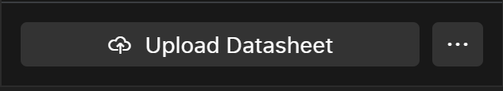

# Embedd Explorer Structure

Embedd Explorer has the following structure:

1. Component Name  reflects part number of the component
2. Documentation  folder that will contain all of the documentation related to the component. Each component might have multiple documentation sources, i.e. reflecting datasheet revisions.
3. Configuration  each Documentation version will have a nested Configuration folder. Configurations are editable representations of Digital Component Model. The folder will contain all of the configurations user generates for that documentation set. A default, “system” configuration will always be available and hold unedited configuration.
4. Drivers  folder with driver source code library will be nested under each configuration, if user generated code for it.

Embedd Explorer Overview

# Adding a New Component

In order to add a new component you must press the Upload Datasheet button in the header of the Component section and select a datasheet to upload. The datasheet needs to be uploaded from a local environment.

Adding component to the system

Processing a datasheet can take anywhere from 5 minutes to an hour. Therefore, components labeled as "processing" will appear in the related tab during this time.

Datasheet Processing State

Onсe the component has been processed user can access digital component model by clicking on the configuration of this component.

# Component Search

User can use search to search for a specific component or configuration. Search functionality cover a partial match and a full match.

