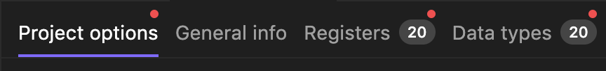
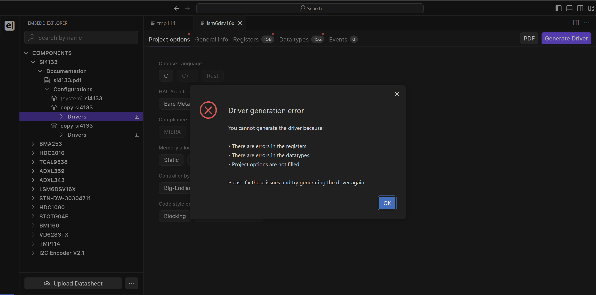
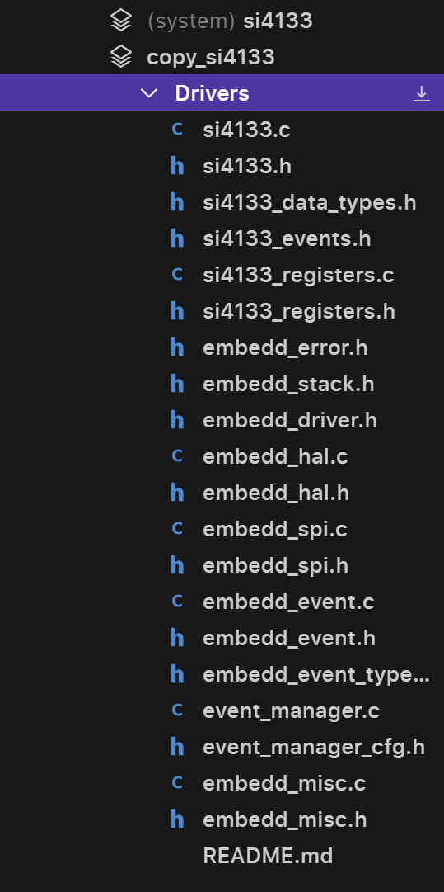
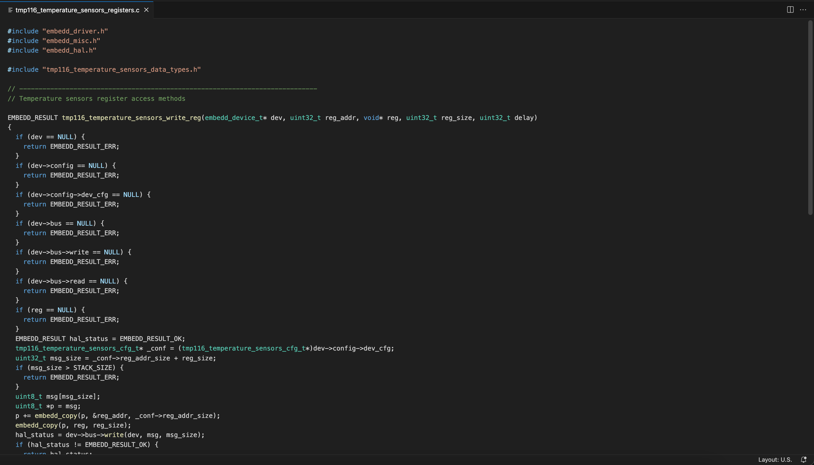
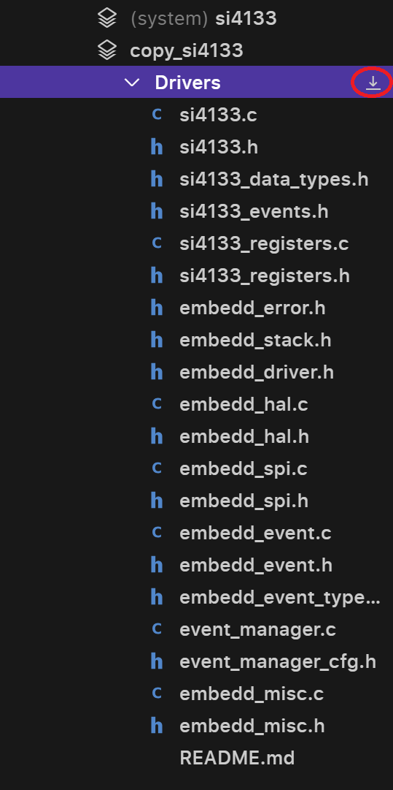

# Completing Device and Project Configuration

Embedd system uses two key components to generate driver:

 - User configuration of the component (See Digital Component Model)
 - User selection of project options (See Project Options)
Please make sure that:

Component Errors are resolved.
 - All Project Options are selected.
 - Without completing and resolving all errors in both section code generation function would not be available.

System will notify you if the section contains error or is incomplete.

Red dot identifies error/incompleteness of the section

Please note that Generate Driver button will be active every time but in order to generate the driver you will have to resolve the issues so you will recieve a notification of unresolved issues that are required to be sloved in order to generate the driver.

As soon as issues are resolved, you menu will look like this:

Active Generate Driver button is purple

# Generating Drivers

Click on Generate Driver button in order to initiate the process.

Please note, that each Configuration can only have one Driver Library attached to it. If you would like to generate a new Driver Library, you can copy configuration. If you change Configuration with Driver Library already generated, old set of code will be lost.

Your Driver Library will appear in Embedd Explorer. [Please see Digital Component Model for more details](/pages/digital-component-model).

Driver library overview in Embedd Explorer

# Code Preview

To preview generated code, select the file in Embedd Explorer. That will open a separate tab with the corresponding file.

Code file preview

Please note that at this moment code editing in file preview is not available. Code could be either copied or exported as library as zip archive.

# Code Export

In order to export your Driver Library click on the download button next to the Driver folder.

