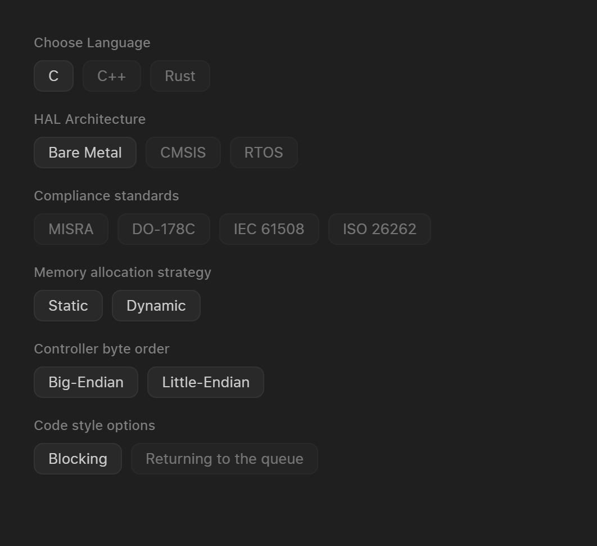

# Navigating to Project Options

In order to successfully generate the code user has to specify project options it needs to generate the code for.

Project option tab is located as a first tab in the device model window.

Device model tabs

Options are separated into the sections and user must select one of the options in each section:

# As of `July 1, 2024` the following options are available:

| Option | Available Selections |
| -------- | ------------------------------------- |
| Language | C |
| HAL Architecture | Bare Metal |
| Memory Allocation Strategy | Static/Dynamic |
| Controller Byte Order | BE/LE |
| Code Style Options | Blocking |
